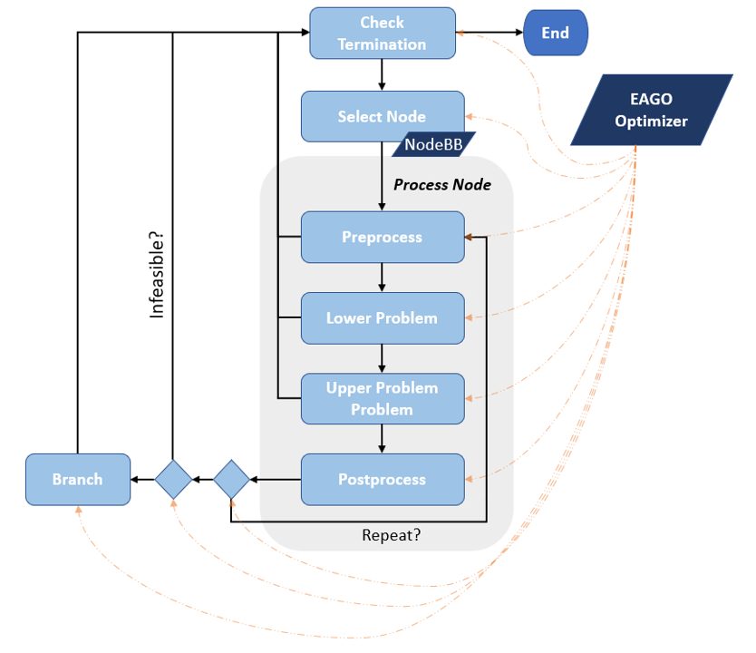

# Overview

This component is meant to provide a flexible framework for implementing spatial branch-and-bound based optimization routines in Julia.
All components of the branch-and-bound routine can be customized by the individual user: lower bounding problem, upper bounding problem.
The branch and bound routine consists of a main solve algorithm that executes as depicted in the flowchart below.
Routines for setting the objects to implement standard B&B routines are also provided using a `set_to_default!()` function.

- The `lower_problem::Function`, `upper_problem::Function`, `preprocess::Function `, and `postprocess::Function` are fields in
the EAGO optimizer each of which should take inputs `(x::EAGO.Optimizer,y::EAGO.NodeBB)`. They each set fields a `SubProblemInfo`
subtypes contained in fields of `x::EAGO.Optimizer`: `current_lower_info::LowerInfo`, `current_upper_info::UpperInfo`,
`current_preprocess_info::PreprocessInfo`, `current_postprocess_info::PostprocessInfo`.

The `EAGO.NodeBB` object is used to store the current subproblem's box constraints and detailed here in the [Backend]() section.
