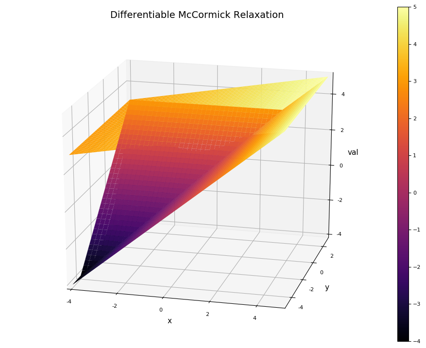

## **Bounding a function via smooth McCormick objects**
In order to bound a function using a McCormick relaxation. You first construct
structure that bounds the input variables then you construct pass these variables
two a function.

In the example below, convex/concave relaxations of the function f(x)=sin(2x)+exp(x)-x
are calculated at x = 1 on the interval [-2,3].

```julia
using EAGO

# create SmoothMcCormick seed object for x = 2.0 on [1.0,3.0] for relaxing
# a function f(x) on the interval box xIbox using mBox as a reference point

f(x) = x*(x-5.0)*sin(x)

x = 2.0                           # value of independent variable x
subx = seed_g(Float64,1,1)        # set initial subgradient of x to [1.0]
Intv = Interval(1.0,4.0)         # define interval to relax over

# create McCormick object
SMC = SMCg{1,Interval{Float64},Float64}(x,x,subx,subx,Intv,false)

fSMC = f(SMC)            # relax the function

cv = fSMC.cv              # convex relaxation
cc = fSMC.cc              # concave relaxation
cvgrad = fSMC.cv_grad     # subgradient/gradient of convex relaxation
ccgrad = fSMC.cc_grad     # subgradient/gradient of concave relaxation
Iv = fSMC.Intv            # retrieve interval bounds of f(x) on Intv
```

The plotting the results we can easily generate visual the convex and concave
relaxations, interval bounds, and affine bounds constructed using the subgradient
at the middle of X.


By setting the differentiability to 1, using the below command and re-plotting we
arrive at the below graph
```julia
set_diff_relax(1)
```


This can readily be extended to multivariate functions as shown below

```julia

set_diff_relax(0)

f(x) = max(x[1],x[2])

x = [2.0 1.0]                                 # values of independent variable x
subx = [seed_g(Float64,1,2) for i=1:2]        # set initial subgradients of x to
                                              # [1.0, 0.0] for x[1], [0.0,1.0] for x[2]
Intv = [Interval(-4.0,5.0),Interval(-5.0,3.0)]  # define intervals to relax over

# create McCormick object
SMC = SMCg{2,Interval{Float64},Float64}(x,x,subx,subx,Intv,false)

fSMC = f(SMC)            # relax the function

cv = fSMC.cv              # convex relaxation
cc = fSMC.cc              # concave relaxation
cvgrad = fSMC.cv_grad     # subgradient/gradient of convex relaxation
ccgrad = fSMC.cc_grad     # subgradient/gradient of concave relaxation
Iv = fSMC.Intv            # retrieve interval bounds of f(x) on Intv
```


