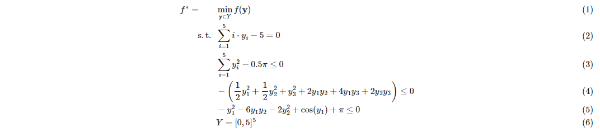

# Simple Example

(This example is also provided [here as a Jupyter Notebook](https://github.com/PSORLab/EAGO-notebooks/blob/master/notebooks/custom_quasiconvex.ipynb))

In this example, we'll adapt EAGO to implement the bisection-based algorithm used to solve
the quasiconvex optimization problem presented in [1]:



where:


Interval analysis shows that the objective value is bounded by the interval **F** such that
$f^*∈ F = [f^L, f^U] = [-5, 0]$. Introducing an auxiliary variable $t∈ T = F$ allows the
problem to be formulated as:


Let $ϕ_τ(y) = f(y) - τ$ such that $\tai = (t^L + t^U)/2$. We solve for $y$ subject to
constraints (24)-(27) where $ϕ_τ (y) ≤ 0$. If this is feasible, $t^*∈ [t^L,τ]$, else
$t^*∈ [τ, t^U]$. The interval containing $t^*$ is kept and the other is fathomed. This
manner of bisection is repeated until an interval containing a feasible solution with a
width of at most ϵ is located [2].


## EAGO Implementation


In the first block, we input parameters values supplied in the paper for $W_1$, $W_2$, 
$B_1$, and $B_2$ into Julia as simple array objects. We also input bounds for the variables
which are used to scale the values obtained from optimization from [-1, 1] back into the
design values.

```julia
using JuMP, EAGO

# Weights associated with the hidden layer
W1 = [ 0.54  -1.97  0.09  -2.14  1.01  -0.58  0.45  0.26;
     -0.81  -0.74  0.63  -1.60 -0.56  -1.05  1.23  0.93;
     -0.11  -0.38 -1.19   0.43  1.21   2.78 -0.06  0.40]

# Weights associated with the output layer
W2 = [-0.91 0.11 0.52]

# Bias associated with the hidden layer
B1 = [-2.698 0.012 2.926]

# Bias associated with the output layer
B2 = -0.46

# Variable bounds (Used to scale variables after optimization)
xLBD = [0.623, 0.093, 0.259, 6.56, 1114,  0.013, 0.127, 0.004]
xUBD = [5.89,  0.5,   1.0,   90,   25000, 0.149, 0.889, 0.049];
```

## Construct the JuMP model and optimize

We now formulate the problem using standard JuMP[3] syntax and optimize it. Note that 
we are forming an NLexpression object to handle the summation term to keep the code 
visually simple, but this could be placed directly in the JuMP @NLobjective expression
instead.

```julia
# Model construction
model = Model(optimizer_with_attributes(EAGO.Optimizer, "absolute_tolerance" => 0.001))
@variable(model, -1.0 <= x[i=1:8] <= 1.0)
@NLexpression(model, y[r=1:3], sum(W1[r,i]*x[i] for i in 1:8))
@NLobjective(model, Max, B2 + sum(W2[r]*(2/(1+exp(-2*y[r]+B1[r]))) for r=1:3))

# Solve the model
optimize!(model)
```

## Retrieve results

We then recover the objective value, the solution value, and termination status codes 
using standard JuMP syntax. The optimal value and solution values are then rescaled 
using the variable bounds to obtain their physical interpretations.

```julia
# Access calculated values
fval = JuMP.objective_value(model)
xsol = JuMP.value.(x)
status_term = JuMP.termination_status(model)
status_prim = JuMP.primal_status(model)
println("EAGO terminated with a status of $status_term and a result code of $status_prim.")
println("The optimal value is: $(round(fval,digits=5)).")
println("The solution found is $(round.(xsol,digits=3)).")
println("")

# Rescale values back to physical space
rescaled_fval = ((fval+1)/2)*0.07
rescaled_xsol = ((xsol.+1.0)./2).*(xUBD-xLBD).+xLBD
println("Rescaled optimal value and solution values:")
println("The rescaled optimal value is: $(round(rescaled_fval,digits=4))")
println("The rescaled solution is $(round.(rescaled_xsol,digits=3)).")
```

## Reference:
1. C. Jansson, Quasiconvex relaxations based on interval arithmetic, Linear Algebra and its Applications, 324 (2001), pp. 27–53.
2. S. Boyd and L. Vandenberghe, Convex optimization, Cambridge University Press, 2004.