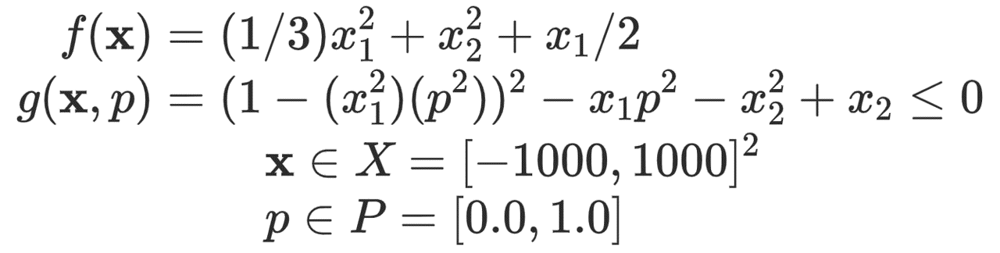

# Solving Semi-Infinite Programming

[Matthew Wilhelm](https://psor.uconn.edu/person/matthew-wilhelm/)  
Department of Chemical and Biomolecular Engineering, University of Connecticut

## Using EAGO to solve a SIP

Semi-infinite programming remains an active area of research. In general, the solution of semi-infinite programs with nonconvex semi-infinite constraints of the below form are extremely challenging:


EAGO implements the SIPres of [1] to determine a globally optimal solution to problems of the above form. This accomplished using the `explicit_sip_solve` function which returns the optimal value, the solution, and a boolean feasibility value. To illustrate the functions use, a simple example is presented here which solves the below problem:



```julia
using EAGO, JuMP

# Define semi-infinite program
f(x) = (1/3)*x[1]^2 + x[2]^2 + x[1]/2
gSIP(x,p) = (1.0 - (x[1]^2)*(p[1]^2))^2 - x[1]*p[1]^2 - x[2]^2 + x[2]

x_l = [-1000.0, -1000.0]
x_u = [1000.0, 1000.0]
p_l = [0.0]
p_u = [1.0]

# Solve the SIP  problem
sip_result = explicit_sip_solve(x_l, x_u, p_l, p_u, f, gSIP)

println("The global minimum of the semi-infinite program is between: $(sip_result.lower_bound) and $(sip_result.upper_bound).")
println("The global minimum is attained at: x = $(sip_result.xsol).")
println("Is the problem feasible? (sip_result.feasibility).")
```

## Semi-infinite solver
```@docs
    explicit_sip_solve
    SIPProblem
    SIPResult
```
