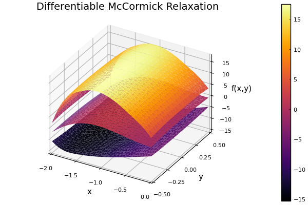

# Basic Usage

## Bounding a Univariate Function

In order to bound a function using a McCormick relaxation, you first construct a McCormick object (`x::MC`) that bounds the input variables, and then you pass these variables to the desired function.

In the example below, convex/concave relaxations of the function ``f(x) = x (x - 5) \sin(x)`` are calculated at ``x = 2`` on the interval ``[1, 4]``.

```julia
using McCormick

# Create MC object for x = 2.0 on [1.0, 4.0] for relaxing
# a function f(x) on the interval Intv

f(x) = x*(x - 5.0)*sin(x)

x = 2.0                          # Value of independent variable x
Intv = interval(1.0, 4.0)        # Define interval to relax over
                                 # Note that McCormick.jl reexports IntervalArithmetic.jl
                                 # and StaticArrays. So no using statement for these is
                                 # necessary.
# Create McCormick object
xMC = MC{1,NS}(x, Intv, 1)

fMC = f(xMC)             # Relax the function

cv = fMC.cv              # Convex relaxation
cc = fMC.cc              # Concave relaxation
cvgrad = fMC.cv_grad     # Subgradient/gradient of convex relaxation
ccgrad = fMC.cc_grad     # Subgradient/gradient of concave relaxation
Iv = fMC.Intv            # Retrieve interval bounds of f(x) on Intv
```

By plotting the results we can easily visualize the convex and concave relaxations, interval bounds, and affine bounds constructed using the subgradient at the middle of ``X``.


If we instead use the constructor `xMC = MC{1,Diff}(x, Intv, 1)` in the above code and re-plot, we arrive at the following graph. Note that these relaxations are differentiable, but not as tight as the nonsmooth relaxations.


## Bounding a Multivariate Function

This can readily be extended to multivariate functions, for example:

```math
\begin{aligned}
f(x,y) = \big(4 - 2.1 x^{2} + \frac{x^{4}}{6} \big) x^{2} + x y + (-4 + 4 y^{2}) y^{2}
\end{aligned}
```

```julia
using McCormick

# Define function
f(x, y) = (4.0 - 2.1*x^2 + (x^4)/6.0)*x^2 + x*y + (-4.0 + 4.0*y^2)*y^2

# Define intervals for independent variables
n = 30
X = interval(-2,0)
Y = interval(-0.5, 0.5)
xrange = range(X.bareinterval.lo, stop=X.bareinterval.hi, length=n)
yrange = range(Y.bareinterval.lo, stop=Y.bareinterval.hi, length=n)

# Calculate differentiable McCormick relaxation
for (i,x) in enumerate(xrange)
    for (j,y) in enumerate(yrange)
        z = f(x, y)                 # Calculate function values
        xMC = MC{1,Diff}(x, X, 1)   # Differentiable relaxation for x
        yMC = MC{1,Diff}(y, Y, 2)   # Differentiable relaxation for y
        fMC = f(xMC, yMC)           # Relax the function
        cv = fMC.cv                 # Convex relaxation
        cc = fMC.cc                 # Concave relaxation
    end
end
```


